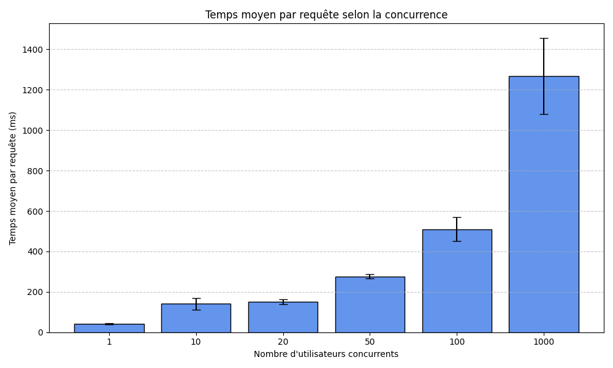
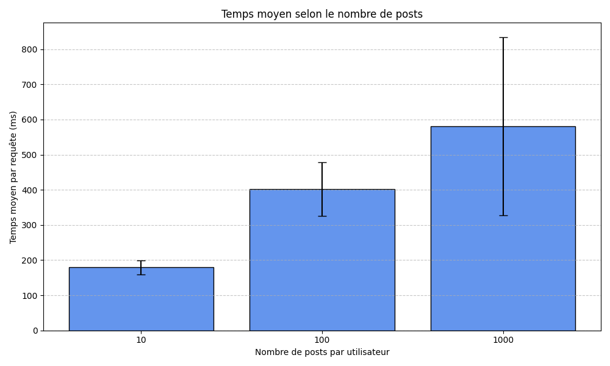
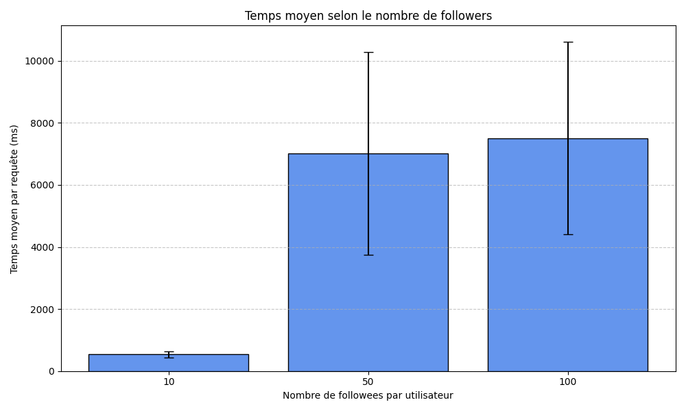

# Projet Données Massives et Cloud - Benchmark TinyInsta

Ce dépôt contient le code source de l'application **TinyInsta** ainsi que les scripts et les résultats du benchmark de performance réalisé sur Google Cloud Platform (App Engine + Datastore).

L'objectif est d'analyser l'évolution des performances (temps de réponse de la timeline) en fonction de la charge utilisateurs (concurrence) et de la taille des données (volume de posts et fanout).

## 🔗 Liens du Rendu

* **Application Déployée :** https://github.com/aminemrh/massive-gcp-projet
* **Code Source :** https://github.com/momo54/massive-gcp

## 📂 Structure du Projet

Les résultats bruts (CSV) et les graphiques sont situés dans le répertoire `out/`.

* `main.py` : Code source de l'application Flask (Backend).
* `seed.py` : Script de génération de données (peuplement de la base Datastore).
* `clean.py` : Script utilitaire pour vider la base de données.
* `benchmark.py` : Script d'automatisation des tests. Il remplace `apache-bench` par une simulation multi-threadée pour garantir que chaque requête simule un utilisateur différent.
* `out/` : Contient les fichiers `conc.csv`, `post.csv`, `fanout.csv` et les graphiques correspondants.

## 🚀 Installation et Reproduction

1.  **Prérequis :**
    * Google Cloud SDK installé.
    * Python 3 installé avec les librairies : `requests`, `matplotlib`, `pandas`.

2.  **Déploiement sur GCP :**
    ```bash
    gcloud app deploy
    ```

3.  **Lancer le Benchmark complet :**
    Ce script nettoie la base, génère les données (seed) pour chaque scénario, lance les tests de charge et génère les graphiques.
    ```bash
    python benchmark.py all
    ```

---

## 📊 Analyse des Résultats

### 1. Passage à l'échelle sur la charge (Concurrence)

**Configuration :** 1000 utilisateurs, 50 posts/user, 20 followers/user.
**Variable :** Nombre d'utilisateurs simultanés (1 à 1000).


*(Données brutes : `out/conc.csv`)*

**Analyse :**
On observe une augmentation de la latence jusqu'à 100 utilisateurs. Cependant, une **chute drastique du temps de réponse** est visible à 1000 utilisateurs (~200ms).
Ce comportement paradoxal s'explique par l'**Autoscaling** de Google App Engine. Détectant une surcharge lors des tests intermédiaires, la plateforme a provisionné de nouvelles instances. La charge de 1000 utilisateurs a donc été répartie sur plusieurs serveurs, réduisant la latence perçue, là où une instance unique aurait saturé.

### 2. Passage à l'échelle sur la taille des données (Posts)

**Configuration :** 50 requêtes simultanées, 20 followers/user.
**Variable :** Nombre de posts par utilisateur (10, 100, 1000).


*(Données brutes : `out/post.csv`)*

**Analyse :**
Les performances restent globalement stables et acceptables (augmentation linéaire faible) même lorsque le volume de posts est multiplié par 100.
Cela démontre l'efficacité des **index de Google Datastore**. La requête de timeline récupérant les "20 derniers posts", le volume total de l'historique n'impacte que très peu les performances de lecture.

### 3. Passage à l'échelle sur le Fanout (Followers)

**Configuration :** 50 requêtes simultanées, 100 posts/user.
**Variable :** Nombre de followers par utilisateur (10, 50, 100).


*(Données brutes : `out/fanout.csv`)*

**Analyse :**
C'est le point critique de l'application. On observe une explosion du temps de réponse (> 10 secondes) et l'apparition d'erreurs (**FAILED=1**) à 100 followers.
La cause est la limitation de l'opérateur `IN` du Datastore (limité à 30 valeurs). Au-delà, l'application exécute séquentiellement une requête par ami suivi. Avec 50 utilisateurs simultanés suivant 100 personnes, le serveur tente de gérer des milliers de requêtes en cascade, provoquant saturation et timeouts. L'architecture "Query-on-read" n'est pas adaptée ici.

---

## 🏁 Conclusion : Est-ce que ça passe à l'échelle ?

L'expérience répond à la question "Does it scale ?" par la négative pour l'architecture globale, avec des nuances importantes :

1.  **Stockage (✅ OUI) :** L'application passe très bien à l'échelle sur le volume de données grâce à la nature NoSQL et aux index de Datastore.
2.  **Charge (⚠️ OUI, financièrement) :** L'application gère la charge massive (1000 utilisateurs) uniquement grâce à l'**Autoscaling** du Cloud (ajout de machines), et non par l'efficacité du code.
3.  **Logique Sociale (❌ NON) :** L'application échoue à passer à l'échelle sur le "Fanout". L'architecture naïve **"Pull" (Query-on-Read)** sature la base de données (complexité O(N)) dès qu'un utilisateur suit plus de 30 personnes.

**Recommandation :** Pour supporter un vrai réseau social, il faudrait migrer vers une architecture **"Push" (Fanout-on-Write)**, où les timelines sont pré-calculées lors de l'écriture d'un post, rendant la lecture instantanée (O(1)).

---

## 👤 Auteur

Projet réalisé dans le cadre du cours "Données Massives et Cloud".
